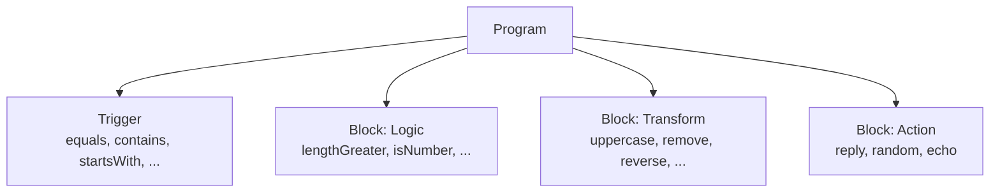
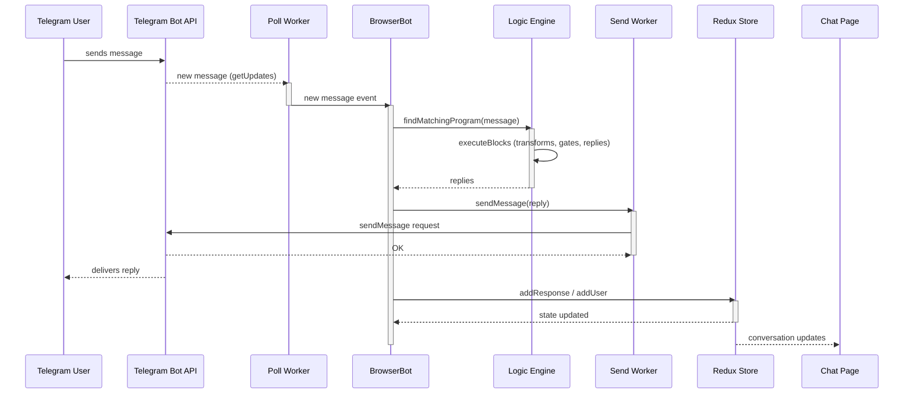
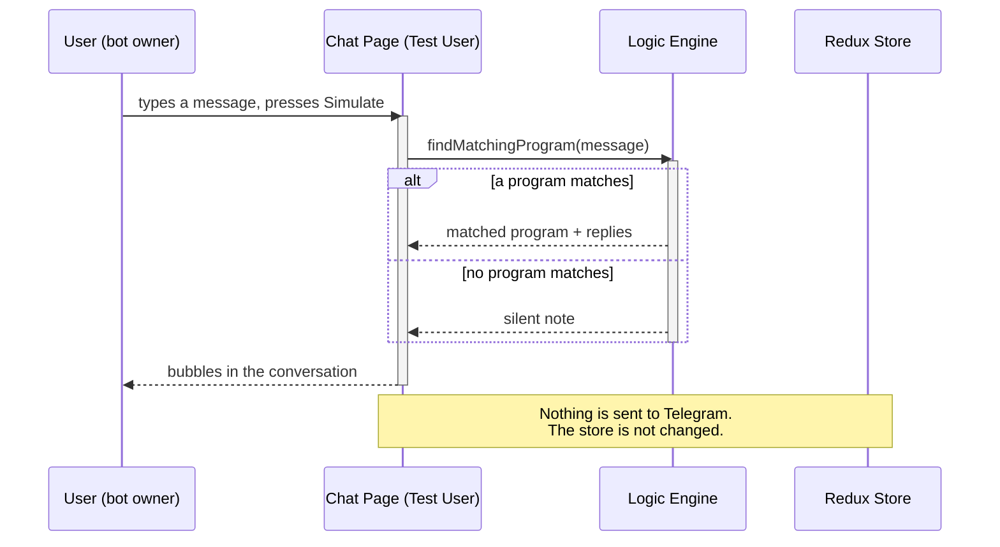
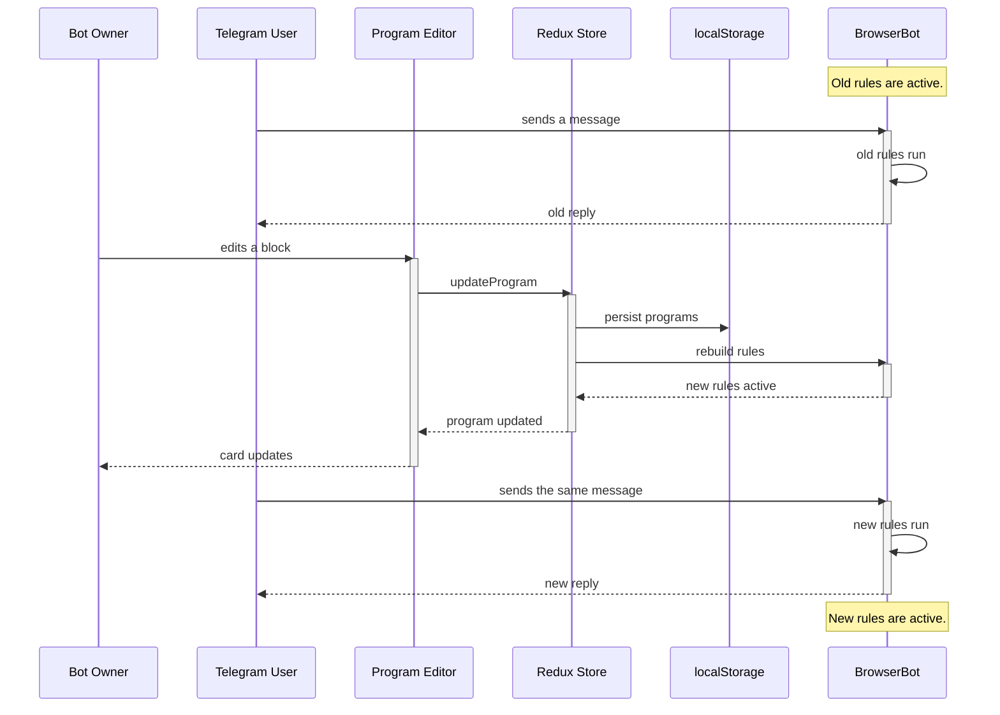

# Architecture

This page explains how the website works under the hood.

## High-level design

The website is a single-page app that runs entirely in the browser. There is
no backend. The page talks to the Telegram Bot API directly, using Web
Workers so the UI never blocks.


## Layers

### UI layer (React + Material UI)

The UI is split into five pages:

- **Programs** — the block editor (`ProgramCard`), the block reference
  (`ProgramPalette`), and the samples panel.
- **Flows** — the visual state-machine editor built on React Flow.
- **Chat** — the live conversation list and the Test User simulator.
- **Settings** — the bot token.
- **Docs** — in-app documentation.

Components are thin. Complex pieces are split into small files: pipeline
primitives (`pipeline.tsx`), block value inputs (`BlockValueInputs.tsx`), and
pure preview logic (`computeFlowPreview` in the logic layer).

### State layer (Redux Toolkit)

The store (`botSlice`) holds five things:

- `token` — the Telegram bot token.
- `programs` — the user's programs (trigger + blocks).
- `flows` — the user's flows (optional field, defaults to an empty list).
- `response` — the message history shown in Chat.
- `users` — the users that have messaged the bot.

The token, programs, and flows are persisted to `localStorage`. The rest is
in-memory only.

### Logic layer (pure functions)

The logic engine lives in `src/logic/program.ts`. It has no React or Redux
dependencies, which makes it easy to test in isolation.

Key functions:

- `matchTrigger` — checks a trigger against a message.
- `executeBlocks` — runs a program's blocks and returns the replies.
- `executeProgram` — trigger match + block execution.
- `findMatchingProgram` — the first program whose trigger matches.
- `validateProgram` — checks a program for errors.
- `computeFlowPreview` — computes the pipeline preview shown on cards.

### Transport layer (BrowserBot)

`BrowserBot` wraps the Telegram Bot API. It creates two Web Workers:

- **poll worker** — polls `getUpdates` for new messages.
- **send worker** — sends messages with `sendMessage`.

The app registers one rule per program:

```
rule = (message, userId) => replies
```

When a message arrives, the first rule whose trigger matches produces the
replies. Rules take an optional `userId` (passed through from the Telegram
chat id) so flow rules can track per-user state. A matching rule that returns
`undefined` (for example, a flow with no matching transition) lets
`handleMessage` continue to the next rule.

## Data model

A **program** has a name, one trigger, and a list of blocks.



Blocks run in order. Transforms change the message as it flows. Logic blocks
can stop the flow. Actions produce replies. A transform can save its output
as a variable with `{name}`, usable in later replies. `{prev}` always means
the current message value.

## Incoming message flow



## Test User simulation flow

The Test User conversation runs the same logic engine but never touches
Telegram. This is how the user previews replies.



## Program editing flow

The bot keeps running while the user edits. Messages that arrive before the
edit is saved are handled by the **old rules**. Once the store rebuilds the
rules, later messages use the **new logic**.



## Flows

Flows are visual state machines. A flow is a graph of **states** connected by
**transitions** labeled with triggers. The Flows engine reuses the program
trigger semantics and is a sibling feature to programs. Programs are still
checked first; flow rules run after them and fall through when no transition
matches.

### Domain model

The flow types live in `src/interfaces/flow.ts`:

```mermaid
flowchart TD
  F[Flow<br/>id, name, startNodeId] --> FN[FlowNode<br/>id, type: start|state, label, replies]
  F --> FE[FlowEdge<br/>id, source, target, trigger]
```

- **Flow** — `{ id, name, startNodeId, nodes, edges }`. Exactly one `start`
  node; `startNodeId` points at it.
- **FlowNode** — a `start` marker or a `state`. A state carries `data.label`
  and `data.replies` (one message per line).
- **FlowEdge** — a transition from `source` to `target` carrying
  `data.trigger = { type, value }`. The trigger type is the program
  `TriggerType` (equals, contains, startsWith, endsWith, notEquals,
  notContains) plus `"fallback"` (matches any message).

### Engine

The pure engine lives in `src/logic/flow.ts` (no React or Redux):

- `matchFlowTrigger(trigger, message)` — `fallback` matches anything;
  otherwise it delegates to `matchTrigger` from `src/logic/program.ts`.
- `executeFlow(flow, message, currentNodeId)` — finds the first edge leaving
  the current node (in **array order**) whose trigger matches and returns the
  target state's replies and id. Returns `undefined` when nothing matches
  (the caller stays in the same state and stays silent).
- `FlowRuntime` — keeps a `Map<userId, nodeId>` per flow so each Telegram
  user's position is tracked independently. `handleMessage` starts a
  brand-new user at `startNodeId`, stores the transition taken, and
  interpolates `{msg}` with the raw message in replies.
- `validateFlow(flow)` — checks the name, exactly one start node, no
  duplicate ids, no edges to missing nodes, and no incoming edges to the
  start node.
- `flowFromSample(sample)` — deep-copies a sample's flow with fresh ids for
  the flow, every node, and every edge so loading a sample twice yields two
  independent flows.

### Runtime integration

`BrowserBot` rules gained an optional `userId` (the Telegram chat id) so flow
rules can key per-user state. In `useBot`, after every program rule is
registered, one rule is registered per flow, each backed by its own
`FlowRuntime`:

```
rule = (message, userId) => runtime.handleMessage(userId ?? 0, message)
```

Because a flow rule's matcher always returns `true`, `BrowserBot.handleMessage`
calls every flow rule in order after the programs. A flow with no matching
transition returns `undefined` and `handleMessage` falls through to the next
rule. The chat preview (Test User) drives the same `FlowRuntime` path, so
what you see in the Chat tab matches a live flow.

### Storage

Flows live in the Redux `botSlice` under an optional `flows` field (empty by
default, so existing saved state loads fine). The flows are persisted to
`localStorage` under the `"flows"` key and are included in Settings
export/import/reset alongside programs and the token.

### Editor

The **Flows** tab uses React Flow (`@xyflow/react` v12). The `FlowsPage`
renders `FlowEditor`, which wraps the canvas in a `<ReactFlowProvider>` with a
palette, toolbar, and inspector. Custom MUI node components (`StartNode`,
`StateNode`) preserve the app's design language. Nodes are added by dragging
from the palette (HTML5 drag-and-drop using the `application/reactflow` MIME
type) and dropped onto the canvas at the pointer position. Connecting nodes
creates a `fallback` transition; clicking a transition opens the inspector to
edit its trigger. Loading a sample dispatches `addFlow` with `flowFromSample`
so ids are always fresh.

## Design decisions

- **No backend.** The bot works as long as the page is open. This keeps the
  hosting simple and the token private.
- **Pure logic engine.** All bot rules are pure functions. This makes the
  behavior testable without a browser or Telegram.
- **First match wins.** When several programs could match, the first one in
  the list runs. Order matters.
- **One bot instance.** `useBot` keeps a single `BrowserBot`. A new token
  stops the old instance and creates a fresh one.
