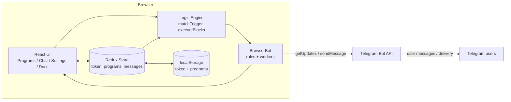
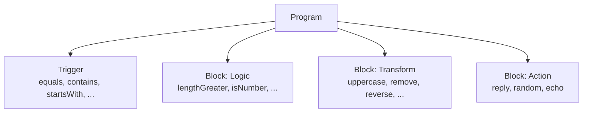
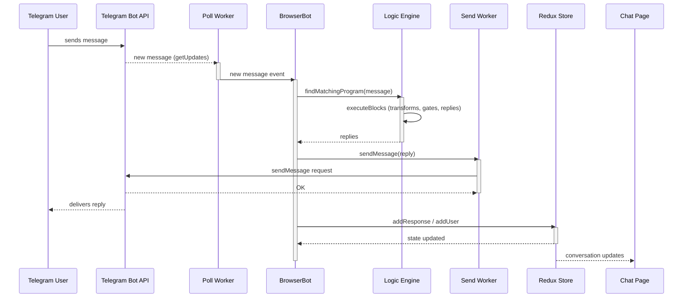
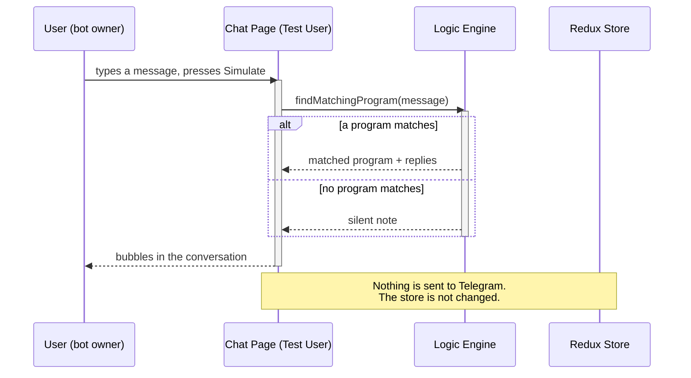
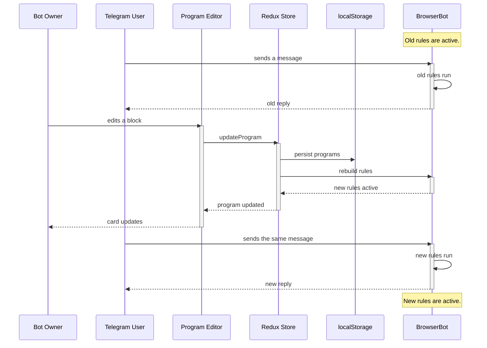

# Architecture

This page explains how the website works under the hood.

## High-level design

The website is a single-page app that runs entirely in the browser. There is
no backend. The page talks to the Telegram Bot API directly, using Web
Workers so the UI never blocks.



## Layers

### UI layer (React + Material UI)

The UI is split into four pages:

- **Programs** — the block editor (`ProgramCard`), the block reference
  (`ProgramPalette`), and the samples panel.
- **Chat** — the live conversation list and the Test User simulator.
- **Settings** — the bot token.
- **Docs** — in-app documentation.

Components are thin. Complex pieces are split into small files: pipeline
primitives (`pipeline.tsx`), block value inputs (`BlockValueInputs.tsx`), and
pure preview logic (`computeFlowPreview` in the logic layer).

### State layer (Redux Toolkit)

The store (`botSlice`) holds four things:

- `token` — the Telegram bot token.
- `programs` — the user's programs (trigger + blocks).
- `response` — the message history shown in Chat.
- `users` — the users that have messaged the bot.

The token and programs are persisted to `localStorage`. The rest is
in-memory only.

### Logic layer (pure functions)

The logic engine lives in `src/logic/program.ts`. It has no React or Redux
dependencies, which makes it easy to test in isolation.

Key functions:

- `matchTrigger` — checks a trigger against a message.
- `executeBlocks` — runs a program's blocks and returns the replies.
- `executeProgram` — trigger match + block execution.
- `findMatchingProgram` — the first program whose trigger matches.
- `validateProgram` — checks a program for errors.
- `computeFlowPreview` — computes the pipeline preview shown on cards.

### Transport layer (BrowserBot)

`BrowserBot` wraps the Telegram Bot API. It creates two Web Workers:

- **poll worker** — polls `getUpdates` for new messages.
- **send worker** — sends messages with `sendMessage`.

The app registers one rule per program:

```
rule = (message) => replies
```

When a message arrives, the first rule whose trigger matches produces the
replies.

## Data model

A **program** has a name, one trigger, and a list of blocks.



Blocks run in order. Transforms change the message as it flows. Logic blocks
can stop the flow. Actions produce replies. A transform can save its output
as a variable with `{name}`, usable in later replies. `{prev}` always means
the current message value.

## Incoming message flow



## Test User simulation flow

The Test User conversation runs the same logic engine but never touches
Telegram. This is how the user previews replies.



## Program editing flow

The bot keeps running while the user edits. Messages that arrive before the
edit is saved are handled by the **old rules**. Once the store rebuilds the
rules, later messages use the **new logic**.



## Design decisions

- **No backend.** The bot works as long as the page is open. This keeps the
  hosting simple and the token private.
- **Pure logic engine.** All bot rules are pure functions. This makes the
  behavior testable without a browser or Telegram.
- **First match wins.** When several programs could match, the first one in
  the list runs. Order matters.
- **One bot instance.** `useBot` keeps a single `BrowserBot`. A new token
  stops the old instance and creates a fresh one.
