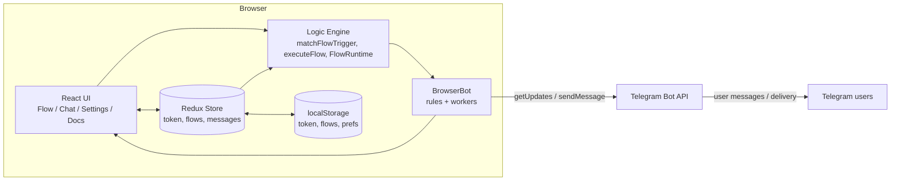
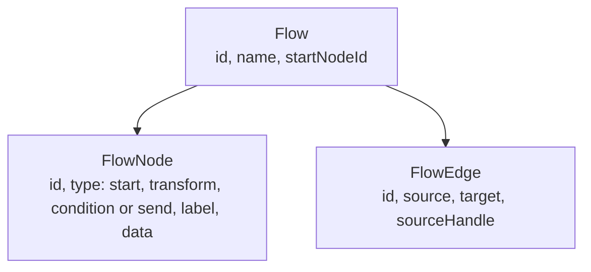
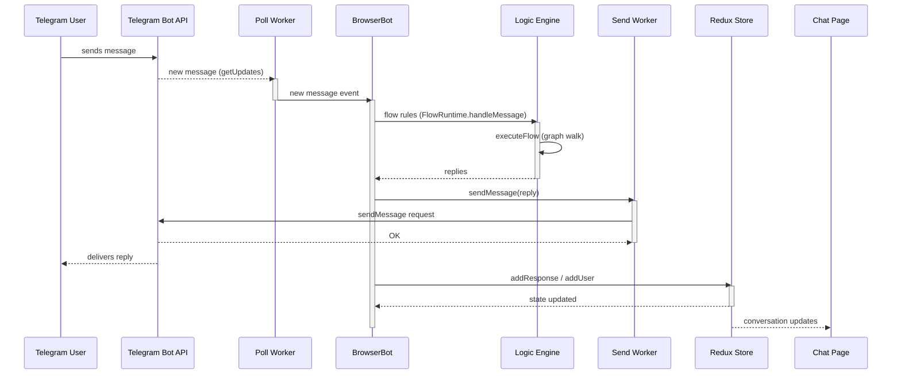
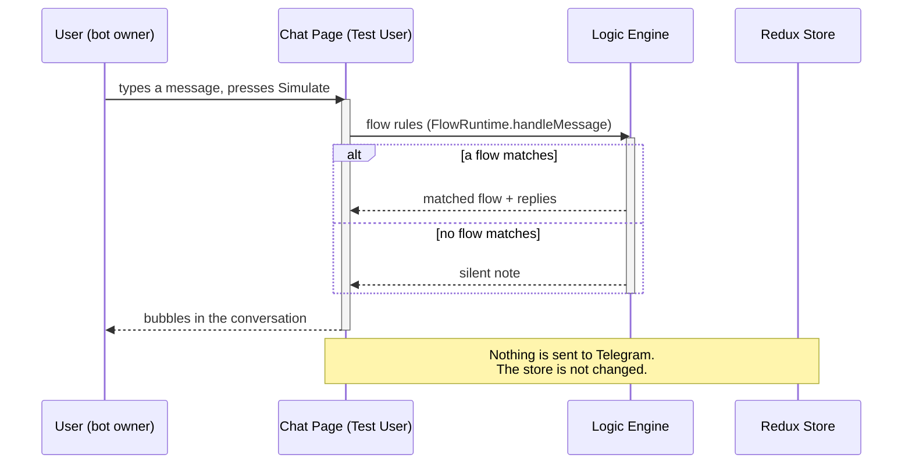
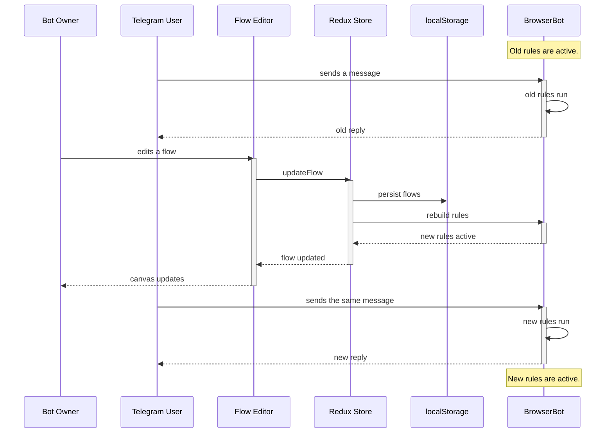

# Architecture

This page explains how the website works under the hood.

## High-level design

The website is a single-page app that runs entirely in the browser. There is
no backend. The page talks to the Telegram Bot API directly, using Web
Workers so the UI never blocks.



## Layers

### UI layer (React + Material UI)

The UI is split into four pages:

- **Flow** — the visual flow editor built on React Flow.
- **Chat** — the live conversation list and the Test User simulator.
- **Settings** — the bot token, auto-start toggle, poll rate, and data
  export/import/reset.
- **Docs** — in-app documentation.

Components are thin. Complex pieces are split into small files: the flow
editor (`FlowEditor.tsx`, `FlowPalette.tsx`, `FlowSamples.tsx`,
`FlowInspector.tsx`, `flowNodes.tsx`) and pure logic (`flow.ts` in the logic
layer).

### State layer (Redux Toolkit)

The store (`botSlice`) holds six things:

- `token` — the Telegram bot token.
- `flows` — the user's flows (optional field, defaults to an empty list).
- `response` — the message history shown in Chat.
- `users` — the users that have messaged the bot.
- `pollRate` — how often the bot polls Telegram for new messages, in
  seconds (default 5).
- `autoStart`, `selectedUserId`, `hydrated` — UI/runtime flags.

The token, flows, auto-start flag and poll rate are persisted to
`localStorage`. The rest is in-memory only.

### Logic layer (pure functions)

The logic engine lives in `src/logic/flow.ts`. It has no React or Redux
dependencies, which makes it easy to test in isolation.

Key functions:

- `applyTransform` — applies a transform (lowercase, uppercase, trim,
  replace, extractRegex) to the message.
- `executeFlow` — walks the graph from the start node, applying transforms,
  evaluating conditions, and returning the replies of the first send node
  reached (or `undefined` when no send node is reached).
- `FlowRuntime` — stateless wrapper around `executeFlow`; every message is
  evaluated from the flow's start node (send nodes are terminal).
- `validateFlow` — structural validation of a flow.
- `flowFromSample` — deep-copies a built-in sample with fresh ids.

### Transport layer (BrowserBot)

`BrowserBot` wraps the Telegram Bot API. It creates two Web Workers:

- **poll worker** — polls `getUpdates` for new messages.
- **send worker** — sends messages with `sendMessage`.

The app registers one rule per flow:

```
rule = (message, userId) => replies
```

When a message arrives, the first rule that produces a result wins. Rules
take an optional `userId` (passed through from the Telegram chat id). A
matching rule that returns `undefined` (for example, a flow that never
reaches a send node) lets `handleMessage` continue to the next rule.

## Data model

A **flow** is a visual graph: a set of **nodes** connected by **edges**.
Every user message starts at the **Start** node and flows through the graph
until it reaches a **Send** node whose replies go back to the user.



When a message arrives, the engine walks the graph from the start node.
**Transform** nodes rewrite the message before passing it on; **Condition**
nodes evaluate it and follow their **if** or **else** edge; **Send** nodes
return their replies (with `{msg}` interpolated to the current message). The
walk is stateless — every message starts from the start node.

## Incoming message flow



## Test User simulation flow

The Test User conversation runs the same logic engine but never touches
Telegram. This is how the user previews replies.



## Editing and rule rebuilds

The bot keeps running while the user edits flows. Messages that arrive before
the edit is saved are handled by the **old rules**. Once the store rebuilds
the rules, later messages use the **new logic**. A fresh `FlowRuntime` per
rebuild picks up the edited flow immediately.



## Flows

Flows are visual graphs and the app's programming model. A flow is a set of
**nodes** connected by **edges**. Every user message starts at the **Start**
node and flows through the graph until it reaches a **Send** node.

### Domain model

The flow types live in `src/interfaces/flow.ts`:


- **Flow** — `{ id, name, startNodeId, nodes, edges }`. Exactly one `start`
  node; `startNodeId` points at it.
- **FlowNode** — one of four types:
  - `start` — the entry marker; carries `data.label`.
  - `transform` — 1 input, 1 output; carries `data.transform` (type +
    find/replacement/pattern params).
  - `condition` — 1 input, 2 outputs; carries `data.trigger`
    (`{ type, value }` where type is one of the six message matchers).
  - `send` — 1 input, no output (terminal); carries `data.replies` (one
    message per line).
- **FlowEdge** — a connection from `source` to `target`. Edges carry no
  trigger data; a condition's branch is recorded in `sourceHandle` (`"if"` /
  `"else"`).

### Engine

The pure engine lives in `src/logic/flow.ts` (no React or Redux):

- `applyTransform(transform, message)` — applies a transform (lowercase,
  uppercase, trim, replace, extractRegex) to the message.
- `executeFlow(flow, message)` — walks the graph from `startNodeId` with a
  visited-set cycle guard. Transform nodes rewrite the message; condition
  nodes follow the `if` edge when their trigger matches and the `else` edge
  otherwise; a send node's replies are returned (with `{msg}` interpolated to
  the current message). Returns `undefined` when the walk cannot reach a send
  node (dead end, cycle, missing branch).
- `FlowRuntime` — stateless wrapper around `executeFlow`. `handleMessage`
  evaluates every message from the start node; `userId` is accepted for API
  stability but ignored. A send node with no replies returns `[]` (the
  message was consumed, so other rules must not pick it up).
- `validateFlow(flow)` — checks the name, exactly one start node, no
  duplicate ids, no edges to missing nodes, no incoming edges to the start
  node, at most one outgoing edge per start/transform node, at most one `if`
  and one `else` edge per condition, and no outgoing edges from send nodes.
- `flowFromSample(sample)` — deep-copies a sample's flow with fresh ids for
  the flow, every node, and every edge so loading a sample twice yields two
  independent flows.

### Runtime integration

`BrowserBot` rules take an optional `userId` (the Telegram chat id). In
`useBot`, one rule is registered per flow, each backed by its own
`FlowRuntime`:

```
rule = (message, userId) => runtime.handleMessage(userId ?? 0, message)
```

Because a flow rule's matcher always returns `true`, `BrowserBot.handleMessage`
calls every flow rule in order. A flow that never reaches a send node returns
`undefined` and `handleMessage` falls through to the next rule. The chat
preview (Test User) drives the same `FlowRuntime` path, so what you see in the
Chat tab matches a live flow.

### Storage

Flows live in the Redux `botSlice` under an optional `flows` field (empty by
default, so existing saved state loads fine). The flows are persisted to
`localStorage` under the `"flows"` key and are included in Settings
export/import/reset alongside the token, the auto-start flag and the poll
rate (`"autoStart"` and `"pollRate"` keys). On mount, `App` hydrates token,
flows, auto-start and poll rate from `localStorage` before marking the store
hydrated (the auto-start decision is made at exactly that point); the
settings page also re-reads the poll rate so the field reflects the saved
preference. Importing an old settings file without a `pollRate` falls back
to the default (5 seconds).

### Editor

The **Flow** tab uses React Flow (`@xyflow/react` v12). The `FlowsPage`
renders `FlowEditor`, which wraps the canvas in a `<ReactFlowProvider>` with a
palette, toolbar, samples, and inspector. Custom MUI node components
(`StartNode`, `TransformNode`, `ConditionNode`, `SendNode`) preserve the
app's design language. Nodes are added by dragging from the palette (HTML5
drag-and-drop using the `application/reactflow` MIME type) and dropped onto
the canvas at the pointer position. Connecting nodes creates a plain edge; a
condition's outgoing edges record `sourceHandle` (`"if"`/`"else"`) and are
labeled on the canvas. Loading a sample dispatches `addFlow` with
`flowFromSample` so ids are always fresh.

## Design decisions

- **No backend.** The bot works as long as the page is open. This keeps the
  hosting simple and the token private.
- **Pure logic engine.** All bot rules are pure functions. This makes the
  behavior testable without a browser or Telegram.
- **First match wins.** When several flows could match, the first one in the
  list runs. Order matters.
- **One bot instance.** `useBot` keeps a single `BrowserBot`. A new token
  stops the old instance and creates a fresh one.
