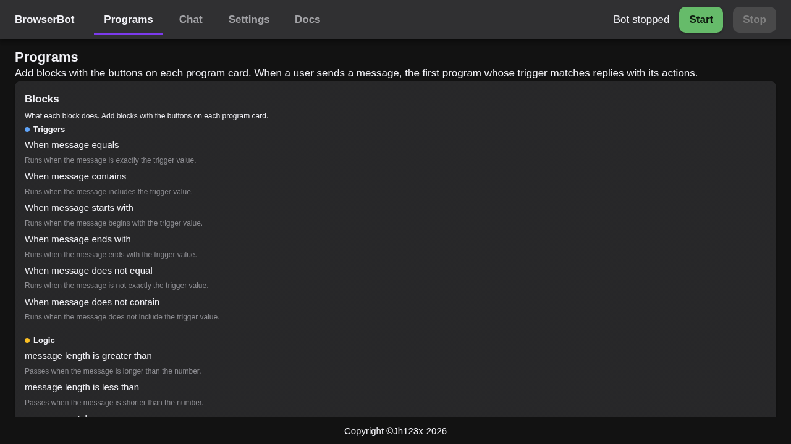

# Features

This page describes what the website does and how to use each feature.

## Programs

The **Programs** tab is the heart of the website. A program is a small set of
rules: when a user sends a message that matches a trigger, the bot runs the
blocks and replies.

### Block reference

The **Blocks** panel lists every available block with a plain-language
description. It is a reference only — blocks are added with the buttons on
each program card.

### Samples

The **Samples** panel loads ready-made programs with one click:

- **Welcome** — replies to `/start`.
- **Coin Flip** — random Heads or Tails on `/flip`.
- **Help** — replies when the message contains "help".
- **Echo Clean** — removes a leading "/say " and echoes the rest.
- **Shout** — echoes your message in uppercase.
- **Shout Back** — makes your message uppercase, then replies
  "You shouted: <message>!".
- **Short Replies** — rejects messages over 10 characters on `/short`.
- **Only Numbers** — rejects non-numbers on `/num`.
- **Title Case** — capitalizes each word on `/title`.
- **Palindrome** — reverses the text on `/reverse`.
- **Capitalize** — capitalizes the first letter on `/cap`.

### Program cards

Each program is a card. A card has one **trigger** and a list of **blocks**.

Blocks fall into four groups:

- **Triggers** — decide when the program runs. Examples: message equals,
  message contains, message does not equal.
- **Logic** — gates that stop the flow when a check fails. Examples: message
  length is greater than, message contains text, message is a number. Every
  check can also be negated (for example, message does not contain, message is
  not a number). You can set an "Else reply" for when the check fails.
- **Transform** — change the message as it flows. Examples: make uppercase,
  remove text, reverse text, capitalize each word.
- **Action** — produce the reply. Examples: reply with text, reply a random
  choice, echo the current message.

The pipeline between blocks is visual: each block shows an **in** and **out**
port, and a chip shows the value that would flow through it (previewed with
the default message "Hello World"). A transform can save its output as a
variable with `{name}`, which you can use in any later reply.

## Chat

The **Chat** tab is where the bot talks to users.

### Live chat

Select a user from the **Conversations** list to see their conversation.
Type a message and press **Send** to reply to that user on Telegram.
The bot runs only while this tab is open and the bot is started.

### Test User

**Test User** is a special conversation that is always in the list. It works
like any other user, but nothing is sent to Telegram.

Type a message and press **Simulate**. The page shows:

- your message as a user bubble,
- which program matched, if any,
- the bot's reply as a normal bubble, or a note when the bot would stay
  silent.

This is the fastest way to try your programs before starting the bot.

## Settings

The **Settings** tab stores your bot token. The token never leaves your
browser. Paste it once, and the bot can start.

## Docs

The **Docs** tab explains the concepts in the browser: how programs work,
variables, blocks, samples, and troubleshooting.
