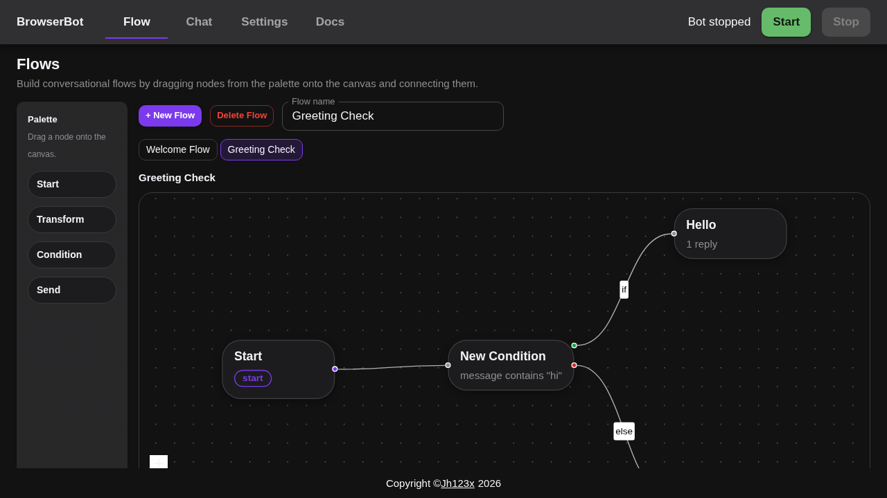
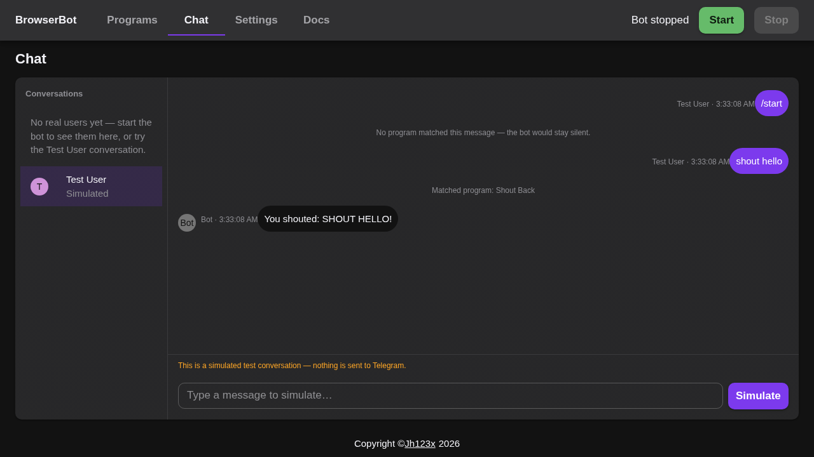

# Features

This page describes what the website does and how to use each feature.

## Flows

The **Flow** tab is a visual graph. A flow is a set of **nodes** drawn on a
canvas and connected by edges. Every user message starts at the **Start**
node, flows through the graph, and ends at a **Send** node whose replies go
back to the user.

### Building a flow

Drag nodes from the palette onto the canvas and connect them by dragging from
a node's output handle to the next node's input handle. Select a node or
edge to edit it in the inspector panel.

- **Start** — the entry marker (exactly one per flow). It has a single
  output and no input.
- **Transform** — 1 input, 1 output. Transforms the message before it
  continues: **lowercase**, **uppercase**, **trim**, **replace text**, or
  **extract regex**. The transformed message is what downstream nodes see
  (both `{msg}` interpolation and condition matching).
- **Condition** — 1 input, 2 outputs. Evaluates the message against one of
  the matchers below and follows the **if** edge when it matches, the
  **else** edge otherwise.
- **Send** — 1 input, no output (terminal). Sends its reply lines and ends
  the flow for this message.

### Condition matchers

A condition node's **if** branch is decided by one of:

- **message equals** a value,
- **message contains** a value,
- **message starts with** a value,
- **message ends with** a value,
- **message does not equal** a value,
- **message does not contain** a value.

The **else** edge catches everything the condition does not match. A
condition without an else edge stays silent on non-matching messages.

### Send replies

Each send node sends one message per line. You can use `{msg}` in a reply to
interpolate the current message — after any transforms, so an *uppercase*
transform followed by a send that says `You said: {msg}` echoes the message
in caps.

### Stateless evaluation

Every user message is evaluated from the Start node — the runtime keeps no
per-user position (send nodes are terminal, so there is nowhere to "wait").
A flow therefore answers each message on its own.

### Single flow

The app keeps ONE flow. Loading a sample replaces the current flow — flows
are never added, named, or deleted. A flow that never reaches a Send node
stays silent.

### Samples

Open the **Flow** tab and click a sample to load it:

- **Welcome Flow** — greets every user.
- **Uppercase Echo** — transforms the message to uppercase, then echoes it
  back with "You said:".
- **Greeting Check** — replies "Hello! 👋" when the message contains "hi",
  otherwise says "Say hi!".

### Persistence

Flows are saved to your browser's localStorage automatically.

## Chat

The **Chat** tab is where the bot talks to users.

### Live chat

Select a user from the **Conversations** list to see their conversation.
Type a message and press **Send** to reply to that user on Telegram.
The bot runs only while this tab is open and the bot is started.

### Test User

**Test User** is a special conversation that is always in the list. It works
like any other user, but nothing is sent to Telegram.

Type a message and press **Simulate**. The page shows:

- your message as a user bubble,
- which flow matched, if any,
- the bot's reply as a normal bubble, or a note when the bot would stay
  silent.

This is the fastest way to try your bot before starting it.

## Settings

The **Settings** tab stores your bot token. The token never leaves your
browser. Paste it once, and the bot can start.

- **Auto start bot on load** — starts the bot automatically when the page
  loads (only if a token is present).
- **Poll rate (seconds)** — how often the bot checks Telegram for new
  messages (default 5s). Lower values respond faster but make more API
  requests. The rate is applied when the bot starts — change it while the
  bot is running by stopping and starting it again.
- **Export settings** — downloads your token, flows and preferences as a
  JSON file.
- **Import settings** — restores settings from an exported JSON file.
  Files without a `pollRate` (old exports) fall back to the default.
- **Reset to default** — clears your token, flows and preferences from
  this browser.

## Docs

The **Docs** tab explains the concepts in the browser: nodes, conditions,
transforms, samples, and troubleshooting.
